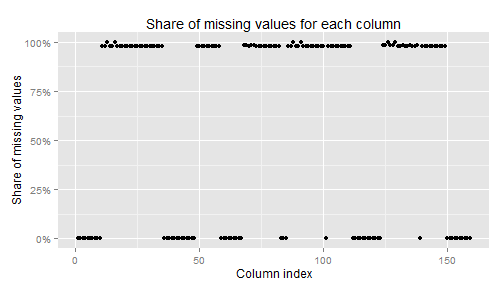
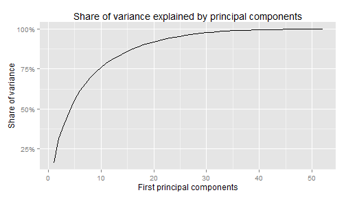
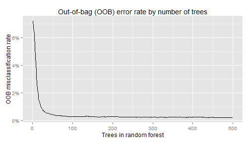

Weight-lifting excercise dataset prediction analysis
========================================================

This analysis was prepared as an assignment for Coursera's Practical Machine
Learning course. The data was collected from wearable accelerometers attached to
6 subjects. Each subject was asked to lift a dumbbell in sets of 10 repetitions
in 5 different styles that correspond to how well the excercise is performed:
- correctly (class A)
- throwing elbows to the front (class B)
- lifting only halfway (class C)
- lowering only halfway (class D)
- throwing hips to the front (class E).

Details about the data and how it was collected can be found at 
[http://groupware.les.inf.puc-rio.br/har#weight_lifting_exercises](http://groupware.les.inf.puc-rio.br/har#weight_lifting_exercises). 

The purpose of this analysis is to correctly predict the class based on
accelerometer data. We are provided with a training set (with marked classes) 
and need to produce estimates for an unmarked test set. 

The training data file was originally downloaded from 
[https://d396qusza40orc.cloudfront.net/predmachlearn/pml-training.csv](https://d396qusza40orc.cloudfront.net/predmachlearn/pml-training.csv).

```r
d <- read.csv("data/pml-training.csv", na.strings = c("#DIV/0!", "NA"))
d$X <- NULL  ## drop line number
dim(d)  ## too large for str
```

```
## [1] 19622   159
```


The data has 159 columns, a large number of features, but a quick look at 
the names and the data itself shows that only some of them have entries on 
most rows:

```r
# get share of NA entries for each column
na.share <- sapply(d, function(x) mean(is.na(x)))
na.share <- data.frame(index = 1:length(na.share), share = na.share)
# plot share for each column
require(ggplot2, quietly = TRUE)  ## for pretty graphics
require(scales, quietly = TRUE)  ## for axis options
ggplot(na.share, aes(x = index, y = share)) + geom_point() + scale_y_continuous(labels = percent_format()) + 
    ggtitle("Share of missing values for each column") + labs(list(x = "Column index", 
    y = "Share of missing values"))
```

 


Most columns are missing 98% or all data. Which columns have mainly 
non-NA entries and which one are mostly `NA`s?

```r
head(na.share[na.share$share < 0.5, ], 10)  ## mostly there
```

```
##                      index share
## user_name                1     0
## raw_timestamp_part_1     2     0
## raw_timestamp_part_2     3     0
## cvtd_timestamp           4     0
## new_window               5     0
## num_window               6     0
## roll_belt                7     0
## pitch_belt               8     0
## yaw_belt                 9     0
## total_accel_belt        10     0
```

```r
head(na.share[na.share$share > 0.5, ], 10)  ## mostly missing
```

```
##                      index  share
## kurtosis_roll_belt      11 0.9798
## kurtosis_picth_belt     12 0.9809
## kurtosis_yaw_belt       13 1.0000
## skewness_roll_belt      14 0.9798
## skewness_roll_belt.1    15 0.9809
## skewness_yaw_belt       16 1.0000
## max_roll_belt           17 0.9793
## max_picth_belt          18 0.9793
## max_yaw_belt            19 0.9798
## min_roll_belt           20 0.9793
```


From the names it becomes clear that the columns with missing values are summary 
statistics of base values, aggregated over a certain number of observations. 
Closer inspection reveals that these columns have non-NA entries only when 
`new_window == "yes"`, which happens at the end of each window 
(marked by `num_window`). Since I am trying to predict from real-time data in 
the test set, I can ignore these columns.

```r
relevant.cols <- rownames(na.share[na.share$share < 0.5, ])
d <- d[, relevant.cols]
```


It is also possible that some of the variables are highly correlated, therefore
making some features mostly redundant. I perform principal components
analysis (PCA) on the data to check whether a small number of components 
captures most of the variance.

```r
pca <- prcomp(x = d[, -c(1:6, 59)], scale = TRUE)  ## all sensor data
# share of variance explained by each component
explained <- data.frame(component = 1:ncol(pca$x), share = pca$sdev^2/sum(pca$sdev^2))
# plot cumulative share of variance explained by first X components
ggplot(explained, aes(x = component, y = cumsum(share))) + geom_line() + scale_y_continuous(labels = percent_format()) + 
    ggtitle("Share of variance explained by principal components") + labs(list(x = "First principal components", 
    y = "Share of variance"))
```

 


The above plot shows a gradual increase in the explained variation, therefore I 
decided not to use principal components, but raw data. I use random forests 
with 500 trees and default settings. This procedure has built-in 
cross-validation (through out-of-bag error rate), so I do not have to deal with specifying folds in order to estimate the expected out-of-sample error rate.

```r
require(randomForest, quietly = TRUE)
```

```
## randomForest 4.6-7
## Type rfNews() to see new features/changes/bug fixes.
```

```r
model.data <- d[, -(1:6)]  ## all features and classe
# train model
set.seed(2014)
rf <- randomForest(classe ~ ., data = model.data, ntree = 500)
print(rf)
```

```
## 
## Call:
##  randomForest(formula = classe ~ ., data = model.data, ntree = 500) 
##                Type of random forest: classification
##                      Number of trees: 500
## No. of variables tried at each split: 7
## 
##         OOB estimate of  error rate: 0.25%
## Confusion matrix:
##      A    B    C    D    E class.error
## A 5578    1    0    0    1   0.0003584
## B    9 3786    2    0    0   0.0028970
## C    0    7 3411    4    0   0.0032145
## D    0    0   20 3194    2   0.0068408
## E    0    0    0    3 3604   0.0008317
```


The reported OOB error rate of 0.25% 
is satisfactorily low, so I will use this prodecure to predict from the 
test data. Based on this low expected error rate I expect to correctly predict all 
20 test cases that are part of the assignment. Below is a plot the progression to see how the number of trees improves 
prediction:

```r
errors.rf <- data.frame(trees = 1:nrow(rf$err.rate), oob = rf$err.rate[, "OOB"])
ggplot(errors.rf, aes(x = trees, y = oob)) + geom_line() + scale_y_continuous(labels = percent_format()) + 
    ggtitle("Out-of-bag (OOB) error rate by number of trees") + labs(list(x = "Trees in random forest", 
    y = "OOB misclassification rate"))
```

 


The plot shows that even a smaller number of trees should result in a similarly 
low error rate. 
